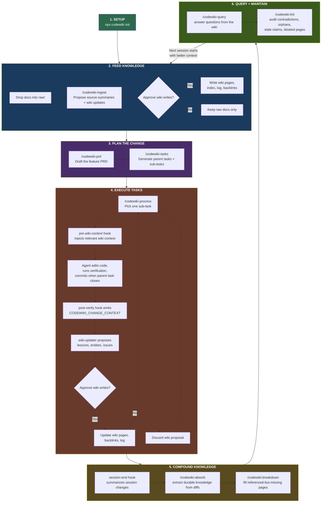
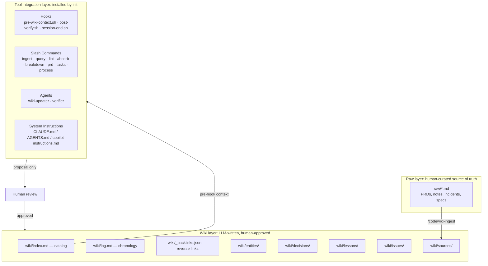
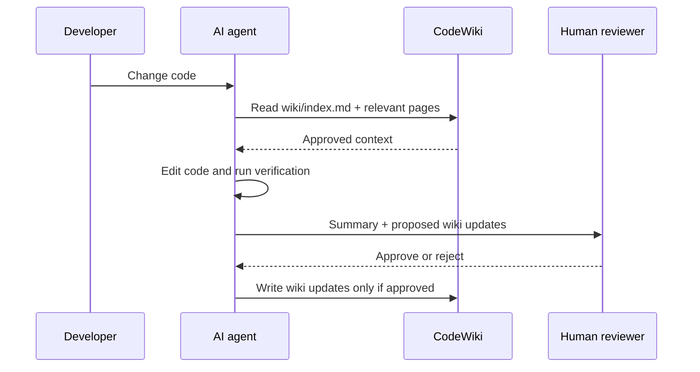

# CodeWiki

CodeWiki is a framework that installs into any AI coding tool and maintains a persistent, LLM-written wiki of verified project knowledge.

Run `npx codewiki init` once — the CLI scaffolds a wiki structure and installs slash commands, hook scripts, and agent definitions into your AI tool. All intelligence (reading wiki, proposing updates, human approval loops) lives in markdown prompt files that the AI tool executes natively. The CLI itself runs zero application logic at runtime.

The result is a compounding knowledge base of decisions, lessons, issues, source summaries, and entity pages that future sessions of Claude Code, Codex, Copilot, or OpenCode can use — so every session starts smarter than the last.

## How it works

The core rule:

> The agent proposes; the human approves; only approved knowledge enters `wiki/`.

### The full developer workflow



**Step by step:**

1. **Setup** — Run `npx codewiki init` once. It scaffolds the wiki and installs hooks, slash commands, and agents into your AI tool.
2. **Feed knowledge** — Drop existing docs (PRDs, architecture notes, incident reports) into `raw/` and run `/codewiki-ingest` to digest them into wiki pages. The agent proposes; you approve.
3. **Plan a feature** — Run `/codewiki-prd` with a feature idea. The agent asks clarifying questions and drafts a PRD. Then `/codewiki-tasks` generates a task breakdown with a checklist.
4. **Build** — Run `/codewiki-process`. The agent works through tasks one sub-task at a time. `pre-wiki-context.sh` injects relevant wiki context before edits, and `post-verify.sh` emits structured change context so the wiki-updater flow can propose targeted wiki updates.
5. **Compound** — After a meaningful coding session, use `/codewiki-absorb` to extract lessons, entity updates, and issues from recent diffs. `session-end.sh` can surface that summary automatically. Then run `/codewiki-breakdown` periodically to create missing high-signal pages from repeated references.
6. **Maintain** — Use `/codewiki-query` before starting similar work, and run `/codewiki-lint` regularly to catch contradictions, orphan pages, stale claims, bloated articles, and missing cross-links.

The wiki compounds over time. Every session leaves the wiki richer for the next one.

### Correct command order

When a developer asks "how do I actually use this?", the intended sequence is:

1. Run `npx codewiki init` once per repository.
2. Put existing source material in `raw/` and run `/codewiki-ingest` until the wiki reflects the project's current state.
3. For new work, run `/codewiki-prd` and then `/codewiki-tasks` before implementation.
4. Execute the work through `/codewiki-process` so the task list, tests, commits, and hook-driven wiki proposals stay aligned.
5. Review every wiki proposal produced by the post-verify flow. Nothing should be written to `wiki/` without explicit approval.
6. At the end of a substantial session, run `/codewiki-absorb` if the session-end hook did not already surface the right proposal.
7. Use `/codewiki-breakdown`, `/codewiki-lint`, and `/codewiki-query` as the ongoing maintenance loop between features.

## Architecture



### Generated project layout

After `codewiki init`, a project gets:

```text
project-root/
├── .codewiki/
│   ├── config.yml                    # Project-level config
│   ├── templates/                    # Page templates for wiki entries
│   │   ├── entity.md
│   │   ├── decision.md
│   │   ├── lesson.md
│   │   ├── issue.md
│   │   └── source-summary.md
│   └── hooks/                        # Shared hook scripts
│       ├── pre-wiki-context.sh       # Injects wiki context before file edits
│       ├── post-verify.sh            # Emits change context for wiki proposals
│       └── session-end.sh            # Auto-absorb on session end
├── raw/                              # Immutable human-curated source documents
├── wiki/
│   ├── index.md                      # Auto-maintained catalog of all pages
│   ├── log.md                        # Chronological record of all operations
│   ├── _backlinks.json               # Reverse link index for importance ranking
│   ├── entities/
│   ├── decisions/
│   ├── lessons/
│   ├── issues/
│   └── sources/
└── (tool-specific files below)
```

Plus tool-specific files depending on `--tool`. For example, Claude Code gets:

```text
.claude/
├── settings.json                     # Tool-specific hook wiring
├── commands/codewiki/
│   ├── ingest.md                     # /codewiki-ingest slash command
│   ├── query.md                      # /codewiki-query
│   ├── lint.md                       # /codewiki-lint
│   ├── absorb.md                     # /codewiki-absorb
│   ├── breakdown.md                  # /codewiki-breakdown
│   ├── prd.md                        # /codewiki-prd
│   ├── tasks.md                      # /codewiki-tasks
│   └── process.md                    # /codewiki-process
└── agents/
    ├── codewiki-wiki-updater.md      # Proposes wiki updates
    └── codewiki-verifier.md          # Validates wiki changes
CLAUDE.md                            # (appended) CodeWiki instructions
```

- `raw/` contains immutable, human-curated markdown sources.
- `wiki/` contains synthesized project knowledge — written only after human approval.
- `.codewiki/` contains config, templates, and shared hook scripts.
- Tool-specific directories (`.claude/`, `.codex/`, `.github/`, `.opencode/`) contain native integration files.

## Install

### Quick start (recommended)

```bash
npx codewiki init --name "My Project"
```

Auto-detects your AI tool and installs everything. Use `--tool` to target specific tools:

```bash
npx codewiki init --tool claude-code
npx codewiki init --tool claude-code,codex
```

### From source

```bash
git clone https://github.com/your-org/codewiki.git
cd codewiki
npm install
npm run build
npm link
codewiki init --name "My Project"
```

## Quick start in a project

```bash
# 1. Initialize CodeWiki in your project
npx codewiki init --name "My Project" --tool claude-code

# 2. Use slash commands inside your AI tool:
#    /codewiki-ingest raw/api-redesign.md
#    /codewiki-prd "add retry policy to API client"
#    /codewiki-tasks tasks/<prd-file>.md
#    /codewiki-process
#    /codewiki-absorb              (extract knowledge from recent changes)
#    /codewiki-breakdown           (find undocumented entities)
#    /codewiki-lint
#    /codewiki-query "what do we know about auth middleware?"

# 3. Hooks run automatically:
#    pre-wiki-context.sh — injects wiki context before file edits
#    post-verify.sh — emits change context for wiki-updater proposals
#    session-end.sh — auto-absorb on session end

# 4. Agents available on demand:
#    codewiki-wiki-updater — proposes wiki updates from session work
#    codewiki-verifier — validates wiki changes before approval
```

## CLI Command

| Command | What it does |
| --- | --- |
| `codewiki init [--tool ...] [--name ...] [--force]` | Scaffolds `.codewiki/`, `raw/`, `wiki/`, and installs slash commands, hooks, and agents for the specified AI tool(s). Re-running is safe — merges without clobbering existing configs. Use `--force` to replace existing CodeWiki sections. |

This is the **only** CLI command. All other intelligence lives in the installed prompt files that your AI tool executes natively.

## Slash Commands

Installed as markdown prompt files into your AI tool's command directory. Use them inside your AI tool session:

| Slash Command | Purpose |
| --- | --- |
| `/codewiki-ingest` | Read a raw source document and propose wiki updates (source summary, entity updates, cross-references) |
| `/codewiki-query` | Search the wiki for relevant context and synthesize an answer with citations. Answers get filed back into the wiki. |
| `/codewiki-lint` | Health-check the wiki: broken links, orphan pages, contradictions, stale claims, file drift, bloated/stub articles |
| `/codewiki-absorb` | Extract lessons, entities, and issues from recent code changes. The compounding loop — every session leaves the wiki richer. |
| `/codewiki-breakdown` | Proactive gap-finding: discover entities referenced in multiple pages but never documented. Ranks by importance. |
| `/codewiki-prd` | Draft a PRD through clarifying questions — saves to `tasks/` for review |
| `/codewiki-tasks` | Generate a task breakdown from a PRD with checklist format |
| `/codewiki-process` | Process tasks one sub-task at a time with verification and conventional commits |

## Hooks

Shared shell scripts in `.codewiki/hooks/`, referenced by each tool's native hook config:

| Hook | Trigger | What it does |
| --- | --- | --- |
| `pre-wiki-context.sh` | Before file edits (PreToolUse) | Reads `wiki/index.md`, finds pages relevant to the files being modified, outputs context for the agent |
| `post-verify.sh` | After file edits (PostToolUse) | Detects wiki-relevant changes and emits structured change context so the tool can run the wiki-updater flow |
| `session-end.sh` | Session end (Stop/session_completed) | Emits a session summary so the tool can run a lightweight absorb pass over recent changes |

All scripts are POSIX-compatible, use `jq` with `grep` fallback, and always exit 0 (never block the agent).

## Agents

Subagent definitions installed into your AI tool's agent directory:

| Agent | Purpose |
| --- | --- |
| `codewiki-wiki-updater` | Receives a description of what changed, reads relevant wiki pages, and proposes specific updates (new lessons, entity updates, issue tracking) |
| `codewiki-verifier` | Reviews proposed wiki changes for contradictions, validates cross-references, and reports confidence levels |

## Multi-tool support

`codewiki init` auto-detects which AI tools are present and installs native integration for each:

| Tool | Hooks | Commands | Agents | Instructions |
| --- | --- | --- | --- | --- |
| **Claude Code** | `.claude/settings.json` (PreToolUse/PostToolUse) | `.claude/commands/codewiki/` | `.claude/agents/` | Appends to `CLAUDE.md` |
| **Codex** | `.codex/hooks.json` | `.codex/commands/codewiki/` | `.codex/agents/` | Appends to `AGENTS.md` |
| **Copilot** | `.github/hooks/` | Custom agent definitions | Custom agents | Appends to `.github/copilot-instructions.md` |
| **OpenCode** | `opencode.json` (session_completed only) | `.opencode/commands/codewiki/` | `.opencode/agents/` | Appends to `AGENTS.md` |

The wiki itself is tool-agnostic — it's just markdown files. The adapters are intentionally thin wrappers that point each tool at the shared wiki and hook scripts.



## Development

```bash
npm install
npm run typecheck    # Type-check without emitting
npm run build        # Compile TypeScript + copy templates to dist/
npm test             # Run vitest unit tests + Node.js integration tests
```

The package compiles TypeScript from `src/` into `dist/` and copies template files (markdown prompts, hook scripts, agent definitions) via a `postbuild` step. Tests use vitest for unit tests and Node's built-in test runner for integration tests.

**Zero runtime dependencies.** TypeScript, vitest, and `@types/node` are dev-only. The published package contains only compiled JavaScript and bundled template files.

## Current non-goals

CodeWiki deliberately does **not** include:

- runtime CLI commands beyond `init`
- LLM API calls from the CLI (all AI work happens inside the AI coding tool)
- embeddings or vector search
- a database, server, or web UI
- non-markdown ingestion
- autonomous wiki writes without human approval (even auto-absorb proposes first)
- autonomous semantic contradiction fixing
- team workflow orchestration

These can be revisited later, but the contract is intentionally small: local markdown, an installer CLI, and human-approved wiki knowledge.

## Project status

CodeWiki v2 is under active development. The v1 runtime CLI has been replaced with an installer-only architecture.

| Phase | Description | Status |
| --- | --- | --- |
| 1. Clean Slate | Delete v1 runtime CLI code | ✅ Complete |
| 2. Shared Infrastructure | Merge utils, scaffold, detection, reporting | ✅ Complete |
| 3. Prompt Templates & Hook Scripts | 6 slash commands, 2 hooks, 2 agents | ✅ Complete |
| 3.1 Auto-Improvement Engine | absorb, breakdown, backlinks, session-end hook | ✅ Complete |
| 4. Claude Code Adapter + init Command | Full end-to-end install via `npx codewiki init` | ⬜ Planned |
| 5. Test Suite | Merge correctness, idempotency, npm pack coverage | ⬜ Planned |
| 6. OpenCode Adapter | session_completed hook strategy | ⬜ Planned |
| 7. Codex & Copilot Adapters | Post-spike adapters | ⬜ Planned |
| 8. npm Publish Hardening | Build script, pack verification, README | ⬜ Planned |

## License

MIT
