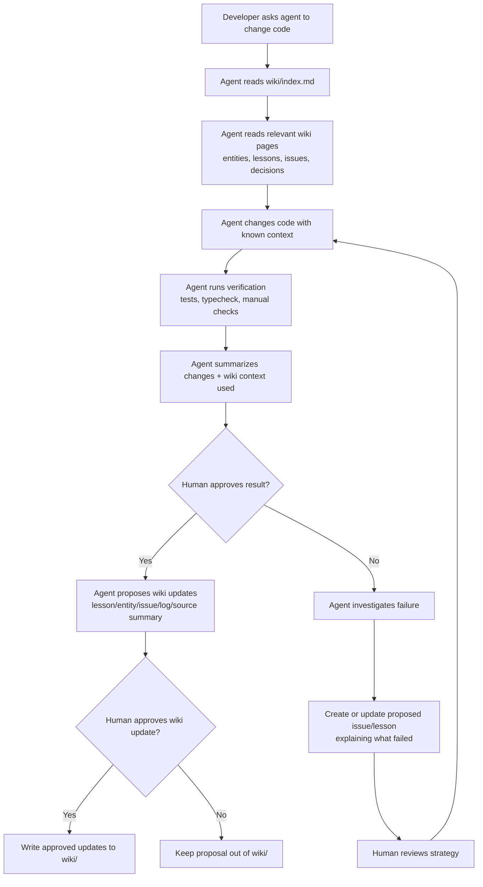
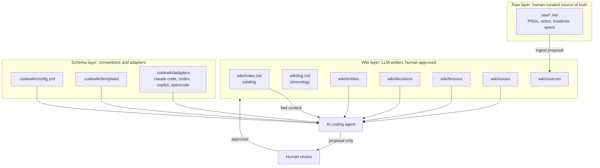
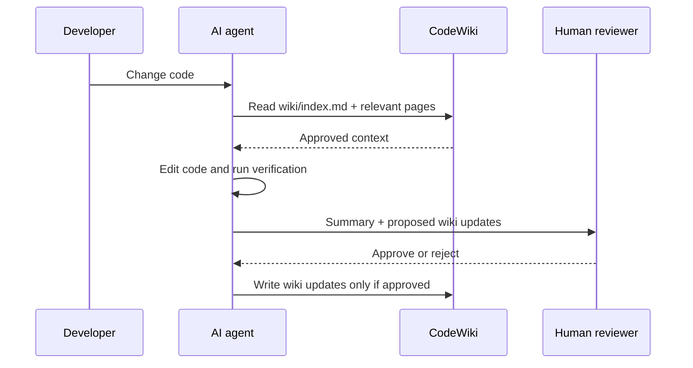

# CodeWiki

CodeWiki is a markdown-first framework for giving AI coding agents durable, human-approved project memory.

Instead of asking an agent to rediscover project context from scratch on every run, CodeWiki installs a small wiki into a project. Agents read the wiki before risky code changes, propose updates after verification, and only write durable knowledge after a human approves it.

The result is a compounding knowledge base of decisions, lessons, issues, source summaries, and entity pages that future Claude Code, Codex, Copilot, OpenCode, or other agents can use.

## The right workflow

The core rule is simple:

> The agent proposes; the human approves; only approved knowledge enters `wiki/`.

Use CodeWiki as a verification loop around coding work, not as an autonomous wiki writer.



For read-only questions, do not trigger hook-style context injection. Ask the wiki explicitly:

```bash
codewiki query "what do we know about retry backoff?"
```

For write tasks, the adapter/instructions should nudge the agent to read CodeWiki context before editing and then stop for review before any wiki mutation.

## Architecture



### Generated project layout

After `codewiki init`, a project gets:

```text
.codewiki/
  config.yml
  templates/
    entity.md
    decision.md
    lesson.md
    issue.md
    source-summary.md
  adapters/
    claude-code/
    codex/
    copilot/
    opencode/
raw/
wiki/
  index.md
  log.md
  entities/
  decisions/
  lessons/
  issues/
  sources/
```

- `raw/` contains immutable, human-curated markdown sources.
- `wiki/` contains synthesized project knowledge that should be written only after human approval.
- `.codewiki/` contains config, templates, and adapter fragments for different AI coding tools.

## Install

### From this repository

```bash
npm install
npm run build
npm link
```

Then use the CLI anywhere as:

```bash
codewiki --help
```

If you do not want to link globally, run it directly from this repo:

```bash
node dist/bin/codewiki.js --help
```

### From npm, once published

```bash
npm install -g codewiki
# or
npx codewiki --help
```

## Quick start in a project

```bash
# 1. Initialize the framework
codewiki init --name "My Project" --tool codex,claude-code

# 2. Ask questions against approved wiki context
codewiki query "what do we know about auth middleware?"

# 3. Add a raw source and generate a proposal only
mkdir -p raw
cp ~/notes/api-redesign.md raw/api-redesign.md
codewiki ingest raw/api-redesign.md

# 4. Run deterministic wiki health checks
codewiki lint

# 5. Draft PRDs/tasks through the same human-review boundary
codewiki prd "add retry policy to API client"
codewiki tasks raw/<generated-prd-file>.md

# 6. Inspect wiki status
codewiki status
```

## Commands

| Command | What it does | Important boundary |
| --- | --- | --- |
| `codewiki init [--tool ...] [--name ...] [--force]` | Creates `.codewiki/`, `raw/`, and `wiki/` scaffolding. | Refuses unsafe overwrites unless `--force` is passed. Does not claim auto-detection. |
| `codewiki ingest <path>` | Reads a markdown raw source and emits a source-summary proposal plus related page checklist. | Does not write final wiki pages. |
| `codewiki query "..."` | Reads `wiki/index.md` first, then matched pages, and emits a context bundle. | Does not file answers back into the wiki. |
| `codewiki lint` | Runs deterministic checks: required files, broken wikilinks, issue lifecycle hints, orphan candidates, and hash drift. | Semantic contradiction/stale-claim review is a checklist, not an automatic fix. |
| `codewiki prd "..."` | Creates a raw PRD draft marked human-review-needed. | Draft is not approved by default. |
| `codewiki tasks <prd-path>` | Creates a task artifact from a PRD. | Tasks remain in the verification/human review loop. |
| `codewiki status` | Reports wiki paths, page counts, issue counts, latest log entry, and drift warnings. | Read-only. |

Proposal-producing commands print:

```text
PROPOSAL ONLY — no wiki files were modified without approval
```

## Adapter guidance

`codewiki init --tool ...` can generate adapter fragments for:

- `claude-code`
- `codex`
- `copilot`
- `opencode`

Use them as instruction fragments or hook examples. In v1, the durable value is the markdown wiki; adapters are intentionally thin.

A good adapter should enforce this behavior:



## Development

```bash
npm install
npm run typecheck
npm run build
npm test
node dist/bin/codewiki.js --help
```

The package compiles TypeScript from `src/` into `dist/` and runs Node's built-in test runner against compiled tests in `dist/test/`.

Runtime dependencies are intentionally empty for v1. `typescript` and `@types/node` are dev-only.

## V1 non-goals

CodeWiki v1 deliberately does **not** include:

- embeddings or vector search
- a database, server, or web UI
- non-markdown ingestion
- autonomous semantic contradiction fixing
- automatic wiki writes after tests pass
- team workflow orchestration
- agent activity logs as raw source
- template migration commands

These can be revisited later, but the v1 contract is intentionally small: local markdown, deterministic CLI helpers, and human-approved wiki knowledge.
