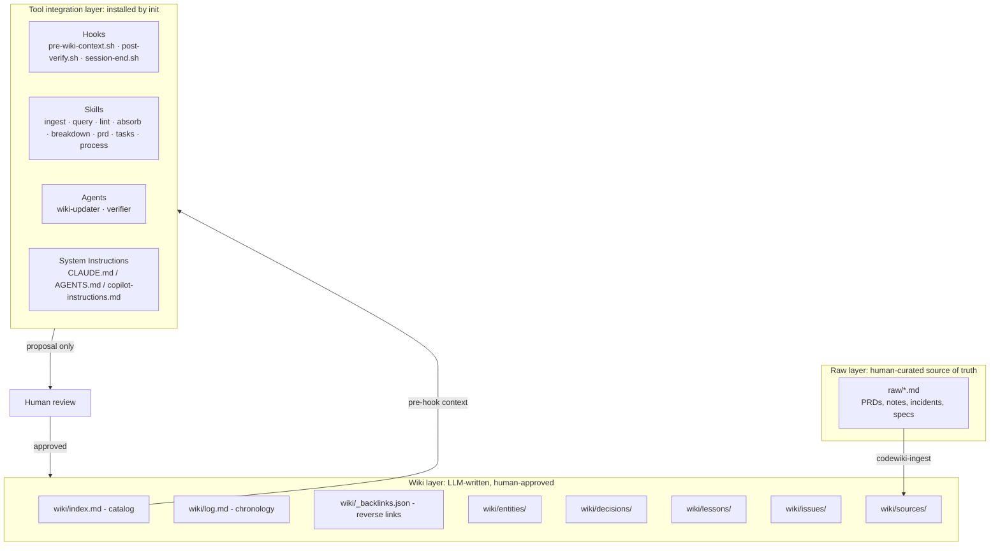

# CodeWiki

CodeWiki is a framework that turns a repository into a persistent, LLM-maintained knowledge system for AI coding tools.

Run `npx codewiki init` once and the CLI scaffolds the wiki plus the tool-facing integration assets that exist today: eight Skills, shared hook scripts, and agent definitions. The logical skill names stay stable across tools (`codewiki-ingest`, `codewiki-query`, `codewiki-lint`, `codewiki-absorb`, `codewiki-breakdown`, `codewiki-prd`, `codewiki-tasks`, `codewiki-process`), while the installer writes them into the canonical skill trees:

- Claude Code selections write `.claude/skills/codewiki-<name>/SKILL.md`
- Codex, Copilot, and OpenCode selections write `.agents/skills/codewiki-<name>/SKILL.md`
- Mixed selections that include Claude Code and any non-Claude tool write both trees

The result is a compounding knowledge base of decisions, lessons, issues, source summaries, and entity pages that future sessions can reuse, so every session starts smarter than the last.

## How it works

The core rule:

> The agent proposes; the human approves; only approved knowledge enters `wiki/`.

The canonical skill names are `codewiki-*`. Different tools may surface them through a skill picker, a command palette, or slash-style invocation, but the installed artifact is always one `SKILL.md` file per logical skill.

### The full developer workflow


**Step by step:**

1. **Setup**: Run `npx codewiki init` once. It scaffolds the wiki and installs the currently shipped integration assets for the selected tool set.
2. **Feed knowledge**: Drop existing docs into `raw/` and run `codewiki-ingest` to digest them into wiki pages. The agent proposes; you approve.
3. **Plan a feature**: Run `codewiki-prd` with a feature idea. The agent drafts the PRD, then `codewiki-tasks` turns it into a task breakdown.
4. **Build**: Run `codewiki-process`. The agent works through tasks one sub-task at a time. `pre-wiki-context.sh` injects relevant wiki context before edits, and `post-verify.sh` emits structured change context so the wiki-updater flow can propose targeted wiki updates.
5. **Compound**: After a meaningful coding session, use `codewiki-absorb` to extract lessons, entity updates, and issues from recent diffs. Then run `codewiki-breakdown` periodically to create missing high-signal pages from repeated references.
6. **Maintain**: Use `codewiki-query` before starting similar work, and run `codewiki-lint` regularly to catch contradictions, orphan pages, stale claims, bloated articles, and missing cross-links.

### Recommended operating order

1. Run `npx codewiki init` once per repository.
2. Put existing source material in `raw/` and run `codewiki-ingest` until the wiki reflects the project's current state.
3. For new work, run `codewiki-prd` and then `codewiki-tasks` before implementation.
4. Execute the work through `codewiki-process` so the task list, verification, commits, and hook-driven wiki proposals stay aligned.
5. Review every wiki proposal produced by the post-verify flow. Nothing should be written to `wiki/` without explicit approval.
6. At the end of a substantial session, run `codewiki-absorb` if the session summary did not already surface the right proposal.
7. Use `codewiki-breakdown`, `codewiki-lint`, and `codewiki-query` as the ongoing maintenance loop between features.

## Architecture



### Generated project layout

After `codewiki init`, every project gets the shared wiki scaffold:

```text
project-root/
├── .codewiki/
│   ├── config.yml                    # Project-level config
│   ├── templates/                    # Page templates for wiki entries
│   │   ├── entity.md
│   │   ├── decision.md
│   │   ├── lesson.md
│   │   ├── issue.md
│   │   └── source-summary.md
│   └── hooks/                        # Shared hook scripts
│       ├── pre-wiki-context.sh
│       ├── post-verify.sh
│       └── session-end.sh
├── raw/                              # Immutable human-curated source documents
├── tasks/                            # Generated PRDs and task breakdowns
├── wiki/
│   ├── index.md
│   ├── log.md
│   ├── _backlinks.json
│   ├── entities/
│   ├── decisions/
│   ├── lessons/
│   ├── issues/
│   └── sources/
└── (tool-specific integration files below)
```

Current skill-tree rules:

- `--tool claude-code` writes `.claude/skills/codewiki-<name>/SKILL.md` and the Claude-only adapter files.
- `--tool codex`, `--tool copilot`, or `--tool opencode` writes `.agents/skills/codewiki-<name>/SKILL.md`.
- Mixed selections such as `--tool claude-code,codex` write both `.claude/skills/` and `.agents/skills/`.
- Claude-only runs deliberately leave `.agents/skills/` absent.

Example Claude Code install surface:

```text
.claude/
├── settings.json                     # Hook wiring
├── skills/
│   ├── codewiki-ingest/SKILL.md
│   ├── codewiki-query/SKILL.md
│   ├── codewiki-lint/SKILL.md
│   ├── codewiki-absorb/SKILL.md
│   ├── codewiki-breakdown/SKILL.md
│   ├── codewiki-prd/SKILL.md
│   ├── codewiki-tasks/SKILL.md
│   └── codewiki-process/SKILL.md
└── agents/
    ├── codewiki-wiki-updater.md
    └── codewiki-verifier.md
CLAUDE.md                             # Appended CodeWiki instructions
```

The shared non-Claude skill install surface is the same eight directories under `.agents/skills/`.

## Install

### Quick start

```bash
npx codewiki init --name "My Project"
```

Auto-detects your local AI tool markers and installs the wiki plus the matching shipped adapters. Use `--tool` when you want to be explicit:

```bash
npx codewiki init --tool claude-code
npx codewiki init --tool codex
npx codewiki init --tool claude-code,codex
```

### From source

```bash
git clone https://github.com/your-org/codewiki.git
cd codewiki
npm install
npm run build
npm link
codewiki init --name "My Project"
```

## Quick start in a project

```bash
# 1. Initialize CodeWiki in your project
npx codewiki init --name "My Project" --tool claude-code,codex

# 2. Invoke the installed skills by their canonical names inside your AI tool
#    codewiki-ingest raw/api-redesign.md
#    codewiki-prd "add retry policy to API client"
#    codewiki-tasks tasks/<prd-file>.md
#    codewiki-process
#    codewiki-absorb
#    codewiki-breakdown
#    codewiki-lint
#    codewiki-query "what do we know about auth middleware?"

# 3. Shared hook scripts are installed into .codewiki/hooks/
#    Claude Code wires them today; future non-Claude adapters reuse the same scripts

# 4. Claude installs agents today:
#    codewiki-wiki-updater
#    codewiki-verifier
```

## CLI command

| Command | What it does |
| --- | --- |
| `codewiki init [--tool ...] [--name ...] [--force]` | Scaffolds `.codewiki/`, `raw/`, `tasks/`, `wiki/`, installs the eight Skills into the canonical skill trees, installs shared hook assets, and applies the shipped tool adapters. Re-running is safe; use `--force` to replace existing CodeWiki-managed sections. |

This is the only CLI command. All other intelligence lives in the installed Skill files and shared scripts that your AI tool executes natively.

## Skills

CodeWiki ships one `SKILL.md` per logical workflow. The invocation UI differs by tool, but the installed skill ids are stable:

| Skill | Purpose |
| --- | --- |
| `codewiki-ingest` | Read a raw source document and propose wiki updates (source summary, entity updates, cross-references) |
| `codewiki-query` | Search the wiki for relevant context and synthesize an answer with citations |
| `codewiki-lint` | Health-check the wiki for contradictions, stale claims, missing links, or weak pages |
| `codewiki-absorb` | Extract lessons, entities, and issues from recent code changes so each session compounds |
| `codewiki-breakdown` | Find high-signal undocumented entities by backlink/reference count and propose new pages |
| `codewiki-prd` | Draft a PRD through clarifying questions and save it under `tasks/` |
| `codewiki-tasks` | Generate a task breakdown from a PRD with checklist structure |
| `codewiki-process` | Work through tasks one sub-task at a time with verification and clean commit hygiene |

## Hooks

Shared shell scripts live in `.codewiki/hooks/`:

| Hook | Purpose |
| --- | --- |
| `pre-wiki-context.sh` | Reads `wiki/index.md`, finds pages relevant to the work about to happen, and surfaces context to the agent |
| `post-verify.sh` | Emits structured change context so the tool can run the wiki-updater flow after verified work |
| `session-end.sh` | Produces a lightweight session summary that can seed an absorb pass |

Today, Claude Code is the fully wired hook adapter. The same scripts are the canonical shared assets for future Codex, Copilot, and OpenCode adapters.

## Agents

Claude installs two supporting agents today:

| Agent | Purpose |
| --- | --- |
| `codewiki-wiki-updater` | Reads the relevant wiki context and proposes concrete updates after verified code changes |
| `codewiki-verifier` | Reviews proposed wiki changes for contradictions, cross-reference quality, and confidence |

## Multi-tool support

`codewiki init` auto-detects tool markers and installs the matching shipped surfaces. Current status:

| Tool | Skills installed today | Hooks today | Agents today | Instructions today |
| --- | --- | --- | --- | --- |
| **Claude Code** | `.claude/skills/codewiki-<name>/SKILL.md` | `.claude/settings.json` | `.claude/agents/` | Appends to `CLAUDE.md` |
| **Codex** | `.agents/skills/codewiki-<name>/SKILL.md` | Pending future adapter work | Pending future adapter work | Pending future adapter work |
| **Copilot** | `.agents/skills/codewiki-<name>/SKILL.md` | Pending future adapter work | Pending future adapter work | Pending future adapter work |
| **OpenCode** | `.agents/skills/codewiki-<name>/SKILL.md` | Pending future adapter work | Pending future adapter work | Pending future adapter work |

Dual-tree rule:

- Claude-only selections write `.claude/skills/` only.
- Non-Claude-only selections write `.agents/skills/` only.
- Mixed selections that include Claude Code write both trees.

The wiki itself is tool-agnostic. The installer keeps the prompt content portable and only changes where the skills are copied.

## Development

```bash
npm install
npm run typecheck
npm run build
npm test
```

The package compiles TypeScript from `src/` into `dist/` and copies template assets during build. Tests combine unit coverage with built integration checks for installer behavior and packaged assets.

**Zero runtime dependencies.** TypeScript, vitest, and `@types/node` are dev-only. The published package contains compiled JavaScript plus bundled template assets.

## Current non-goals

CodeWiki deliberately does not include:

- runtime CLI commands beyond `init`
- direct LLM API calls from the CLI
- embeddings or vector search
- a database, server, or web UI
- non-markdown ingestion
- autonomous wiki writes without human approval
- autonomous semantic contradiction fixing
- team workflow orchestration

## Project status

CodeWiki v2 is under active development, but the installer-only architecture and the skills canon are already in place.

| Phase | Description | Status |
| --- | --- | --- |
| 1 | Clean Slate | ✅ Complete |
| 2 | Shared Infrastructure | ✅ Complete |
| 3 | Prompt Templates and Hook Scripts | ✅ Complete |
| 3.1 | Auto-Improvement Engine | ✅ Complete |
| 4 | Claude Code Adapter plus init rewrite | ✅ Complete |
| 4.1 | Skills Migration and docs canon refresh | ✅ Complete |
| 5 | Test Suite | ✅ Complete |
| 6 | OpenCode Adapter | ⬜ Planned |
| 7 | Codex and Copilot Adapters | ⬜ Planned |
| 8 | npm Publish Hardening | ⬜ Planned |

## License

MIT
