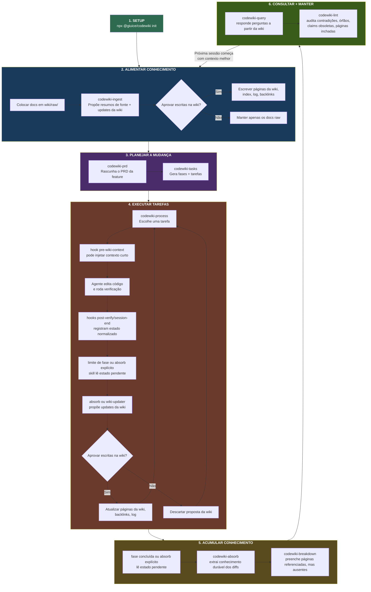
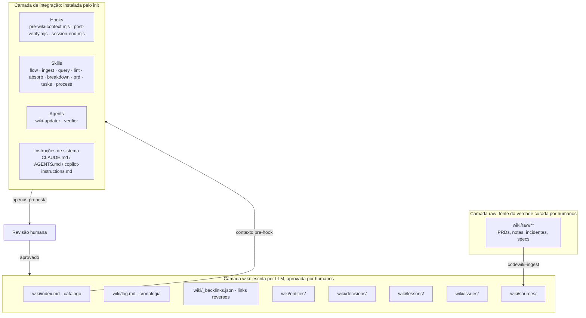

# CodeWiki

[English](README.md) | [Português](README.pt-BR.md)

CodeWiki é um framework que transforma um repositório em um sistema de conhecimento persistente, mantido por LLMs, para ferramentas de programação com agentes de IA.

Rode `npx @giuice/codewiki init` uma vez e a CLI cria a wiki junto com os assets de integração disponíveis hoje para as ferramentas: dez Skills, scripts de hook compartilhados e definições de agentes. Os nomes lógicos das skills permanecem estáveis entre ferramentas (`codewiki-ingest`, `codewiki-query`, `codewiki-lint`, `codewiki-absorb`, `codewiki-breakdown`, `codewiki-obsidian`, `codewiki-prd`, `codewiki-tasks`, `codewiki-process`, `codewiki-flow`), enquanto o instalador grava esses arquivos nas árvores canônicas de skills:

- Seleções de Claude Code escrevem `.claude/skills/codewiki-<name>/SKILL.md`
- Seleções de Codex, Copilot e OpenCode escrevem `.agents/skills/codewiki-<name>/SKILL.md`
- Seleções mistas que incluem Claude Code e qualquer ferramenta não-Claude escrevem nas duas árvores

O resultado é uma base de conhecimento cumulativa com decisões, lições, problemas, resumos de fontes e páginas de entidades que sessões futuras podem reutilizar. Assim, cada sessão começa mais inteligente que a anterior.

## Como Funciona

A regra central:

> O agente propõe; o humano aprova; só conhecimento aprovado entra em `wiki/`.

Os nomes canônicos das skills são `codewiki-*`. Ferramentas diferentes podem expor essas skills por um seletor de skills, uma paleta de comandos ou uma invocação parecida com slash command, mas o artefato instalado é sempre um arquivo `SKILL.md` por skill lógica.

Use `codewiki-flow` quando quiser que o agente escolha o próximo workflow CodeWiki a partir do estado do repositório em vez de nomear uma skill específica.

O fluxo abaixo é a fonte da verdade operacional do CodeWiki. Quando o comportamento de hooks, roteamento de agentes ou responsabilidades das skills mudar, atualize este fluxo e a seção Hooks na mesma mudança para manter todos os adapters com a mesma semântica.

### O Fluxo Completo do Desenvolvedor



**Passo a passo:**

1. **Setup**: Rode `npx @giuice/codewiki init` uma vez. Ele cria a wiki e instala os assets de integração atualmente disponíveis para o conjunto de ferramentas selecionado.
2. **Alimentar conhecimento**: Coloque documentos existentes em `wiki/raw/` e rode `codewiki-ingest` para digeri-los em páginas da wiki. O agente propõe; você aprova.
3. **Planejar uma feature**: Rode `codewiki-prd` com uma ideia de feature. O agente rascunha o PRD, então `codewiki-tasks` transforma isso em fases com tarefas executáveis.
4. **Construir**: Rode `codewiki-process`. O agente trabalha uma tarefa por vez dentro da fase atual. Hooks são sensores silenciosos: eles podem injetar uma dica curta no início do prompt, mas o trabalho confiável deles é registrar pendências de absorb qualificadas por host em `.codewiki/state/`.
5. **Acumular**: Em uma fase concluída ou pedido explícito de absorb, use `codewiki-absorb` para extrair lições, atualizações de entidades e problemas a partir dos diffs recentes e estado pendente. Depois rode `codewiki-breakdown` periodicamente para criar páginas importantes ausentes a partir de referências repetidas.
6. **Manter**: Use `codewiki-query` antes de começar trabalhos parecidos, e rode `codewiki-lint` regularmente para encontrar contradições, páginas órfãs, claims obsoletas, artigos inchados e links cruzados ausentes.

### Ordem Operacional Recomendada

1. Rode `npx @giuice/codewiki init` uma vez por repositório.
2. Coloque material-fonte existente em `wiki/raw/` e rode `codewiki-ingest` até a wiki refletir o estado atual do projeto.
3. Para trabalho novo, rode `codewiki-prd` e depois `codewiki-tasks` antes da implementação.
4. Execute o trabalho por `codewiki-process` para que o plano de fases, verificação e estado pendente de absorb fiquem alinhados. Skills CodeWiki não criam commits automaticamente; o usuário controla o git.
5. Revise toda proposta de wiki produzida por absorb ou wiki-updater. Nada deve ser escrito em `wiki/` sem aprovação explícita.
6. Em uma fase concluída ou ponto explícito de handoff, rode `codewiki-absorb` se o estado pendente ou os diffs recentes contiverem conhecimento durável.
7. Use `codewiki-breakdown`, `codewiki-lint` e `codewiki-query` como o loop contínuo de manutenção entre features.

## Arquitetura



### Layout Gerado no Projeto

Depois de `codewiki init`, cada projeto recebe o scaffold compartilhado da wiki:

```text
project-root/
├── .codewiki/
│   ├── config.yml                    # Configuração do projeto
│   ├── templates/                    # Templates de páginas da wiki
│   │   ├── entity.md
│   │   ├── decision.md
│   │   ├── concept.md
│   │   ├── comparison.md
│   │   ├── lesson.md
│   │   ├── issue.md
│   │   ├── query.md
│   │   └── source-summary.md
│   ├── hooks/                        # Scripts de hook compartilhados
│       ├── codewiki-hook-lib.mjs
│       ├── pre-wiki-context.mjs
│       ├── post-verify.mjs
│       ├── session-end.mjs
│       ├── pre-wiki-context.sh      # fallback POSIX
│       ├── post-verify.sh           # fallback POSIX
│       └── session-end.sh           # fallback POSIX
│   ├── state/                        # Diagnóstico de hooks e pendências de absorb
│   └── tasks/                        # PRDs e planos de fases
├── wiki/
│   ├── SCHEMA.md
│   ├── raw/                         # Documentos-fonte imutáveis curados por humanos
│   │   ├── articles/
│   │   ├── papers/
│   │   ├── transcripts/
│   │   ├── specs/
│   │   └── assets/
│   ├── index.md
│   ├── log.md
│   ├── _backlinks.json
│   ├── entities/
│   ├── decisions/
│   ├── concepts/
│   ├── comparisons/
│   ├── lessons/
│   ├── issues/
│   ├── sources/
│   └── queries/
└── (arquivos de integração específicos da ferramenta abaixo)
```

Regras atuais das árvores de skills:

- `--tool claude-code` escreve `.claude/skills/codewiki-<name>/SKILL.md` e os arquivos do adapter exclusivo do Claude.
- `--tool codex`, `--tool copilot` ou `--tool opencode` escreve `.agents/skills/codewiki-<name>/SKILL.md`.
- Seleções mistas como `--tool claude-code,codex` escrevem tanto em `.claude/skills/` quanto em `.agents/skills/`.
- Execuções somente Claude deixam `.agents/skills/` ausente de propósito.

Exemplo de superfície instalada para Claude Code:

```text
.claude/
├── settings.json                     # Wiring de hooks
├── skills/
│   ├── codewiki-ingest/SKILL.md
│   ├── codewiki-query/SKILL.md
│   ├── codewiki-lint/SKILL.md
│   ├── codewiki-absorb/SKILL.md
│   ├── codewiki-breakdown/SKILL.md
│   ├── codewiki-obsidian/SKILL.md
│   ├── codewiki-prd/SKILL.md
│   ├── codewiki-tasks/SKILL.md
│   ├── codewiki-process/SKILL.md
│   └── codewiki-flow/SKILL.md
└── agents/
    ├── codewiki-wiki-updater.md
    └── codewiki-verifier.md
CLAUDE.md                             # Instruções CodeWiki anexadas
```

A superfície compartilhada de skills para ferramentas não-Claude é o mesmo conjunto de dez diretórios sob `.agents/skills/`.

## Instalação

### Começo Rápido

```bash
npx @giuice/codewiki init --name "Meu Projeto"
```

Detecta automaticamente os marcadores locais das suas ferramentas de IA e instala a wiki junto com os adapters correspondentes disponíveis. Use `--tool` quando quiser ser explícito:

```bash
npx @giuice/codewiki init --tool claude-code
npx @giuice/codewiki init --tool codex
npx @giuice/codewiki init --tool copilot
npx @giuice/codewiki init --tool opencode
npx @giuice/codewiki init --tool claude-code,codex
```

Para conferir a versão publicada do pacote, use `npm exec --yes --package=@giuice/codewiki -- codewiki --version`. `npm --yes @giuice/codewiki --version` imprime a versão do cliente npm, não a versão do CodeWiki.

### A Partir do Código-Fonte

```bash
git clone https://github.com/your-org/codewiki.git
cd codewiki
npm install
npm run build
npm link
codewiki init --name "Meu Projeto"
```

## Começo Rápido em um Projeto

```bash
# 1. Inicialize CodeWiki no seu projeto
npx @giuice/codewiki init --name "Meu Projeto" --tool claude-code,codex

# 2. Invoque as skills instaladas pelos nomes canônicos dentro da sua ferramenta de IA
#    codewiki-ingest wiki/raw/specs/api-redesign.md
#    codewiki-prd "adicionar política de retry ao cliente de API"
#    codewiki-tasks .codewiki/tasks/<arquivo-prd>.md
#    codewiki-process
#    codewiki-absorb
#    codewiki-breakdown
#    codewiki-lint
#    codewiki-obsidian
#    codewiki-query "o que sabemos sobre auth middleware?"
#    codewiki-flow

# 3. Scripts de hook compartilhados são instalados em .codewiki/hooks/
#    Cada adapter os mapeia para o modelo de hook ou plugin da ferramenta hospedeira

# 4. Claude, Codex, Copilot e OpenCode instalam agentes auxiliares:
#    codewiki-wiki-updater
#    codewiki-verifier
```

## Comando da CLI

| Comando | O que faz |
| --- | --- |
| `codewiki init [--tool ...] [--name ...] [--force]` | Cria `.codewiki/`, `.codewiki/tasks/` e `wiki/`, instala hooks compartilhados em `.codewiki/hooks/`, instala as dez Skills nas árvores canônicas de skills e aplica os adapters disponíveis. O relatório separa `Wiki scaffold`, `Shared hooks` e cada seção de adapter. Reexecutar atualiza seções de instrução gerenciadas pelo CodeWiki e assets copiados dos adapters que mudaram, como skills, hooks e agentes, preservando conteúdo de usuário não relacionado. Use `--force` para substituir arquivos protegidos do scaffold. |

Esse é o único comando da CLI. Toda a outra inteligência vive nos arquivos Skill instalados e nos scripts compartilhados que a sua ferramenta de IA executa nativamente.

## Skills

CodeWiki inclui um `SKILL.md` por workflow lógico. A UI de invocação muda por ferramenta, mas os ids instalados das skills são estáveis:

| Skill | Objetivo |
| --- | --- |
| `codewiki-ingest` | Ler um documento-fonte em raw e propor atualizações da wiki (resumo de fonte, entidades, links cruzados) |
| `codewiki-query` | Buscar contexto relevante na wiki e sintetizar uma resposta com citações |
| `codewiki-lint` | Fazer health-check da wiki por contradições, claims obsoletas, links ausentes ou páginas fracas |
| `codewiki-absorb` | Extrair lições, entidades e problemas de mudanças recentes no código para que cada sessão acumule conhecimento |
| `codewiki-breakdown` | Encontrar entidades importantes ainda não documentadas por contagem de backlinks/referências e propor novas páginas |
| `codewiki-obsidian` | Configurar e auditar a wiki como vault compatível com Obsidian, com assets, wikilinks e frontmatter estáveis |
| `codewiki-prd` | Rascunhar um PRD por perguntas de esclarecimento e salvar em `.codewiki/tasks/` |
| `codewiki-tasks` | Gerar fases e tarefas executáveis a partir de um PRD com estrutura de checklist |
| `codewiki-process` | Trabalhar uma tarefa por vez dentro das fases, com verificação, atualização do plano e higiene limpa de git |
| `codewiki-flow` | Escolher a skill CodeWiki correta para setup, ingestão, consulta, feature work, pendências de absorb, absorção, breakdown e lint |

## Hooks

Scripts Node compartilhados ficam em `.codewiki/hooks/`; fallbacks POSIX `.sh` continuam instalados por compatibilidade legada, mas são fallbacks mínimos, não a superfície canônica de comportamento:

Hooks são normalizados como sensores, não como motores de workflow. Entre Claude Code, Codex, Copilot e OpenCode, o contrato CodeWiki é o mesmo quando os nomes de eventos do host mudam:

- stdout fica silencioso por padrão; contexto visível é curto, consultivo e dependente do host.
- scripts Node de hook compartilhados são instalados para todo caminho de adapter suportado durante `codewiki init`.
- sinais duráveis são gravados em `.codewiki/state/pending-absorb.jsonl`.
- eventos de absorb pendente incluem campos práticos de roteamento como `timestamp`, `source`, `host`, `event`, `reason`, `files` e `topic_candidates`; entradas pós-edição incluem `payload_hash`, enquanto entradas de ciclo de vida incluem `diff_stat` e `diff_hash`.
- sinais duplicados são suprimidos por host, evento, arquivos e hash; o hash de ciclo de vida ignora `.codewiki/state/**` para o hook não se reativar por causa do próprio estado quando esses arquivos estão versionados.
- traces de debug são gravados em `.codewiki/state/hooks-debug.jsonl` só quando `CODEWIKI_HOOK_DEBUG=1`.
- contexto de prompt é filtrado para intenção explícita de workflow CodeWiki/wiki e deduplicado em `.codewiki/state/`; `CODEWIKI_HOOK_CONTEXT_BYPASS=1` é um bypass diagnóstico opt-in.
- wrappers executam hooks Node compartilhados e definem `CODEWIKI_HOOK_HOST` / `CODEWIKI_HOOK_EVENT` antes do dispatch; Codex usa `commandWindows` e Copilot usa campos `powershell` para Windows; o plugin OpenCode também limita a execução do hook com a mesma janela de timeout de 30s.
- hooks Node limitam trabalho caro em payloads e arquivos untracked para que a execução consultiva continue pequena em projetos com saídas grandes de ferramenta ou árvores untracked grandes.
- fallbacks POSIX `.sh` mantêm o contrato silencioso de registro de estado para integrações legadas/manuais, mas podem omitir detalhes mais novos exclusivos do caminho Node, como hash de lifecycle com untracked.
- o follow-up com updater/verifier é invocado por skills como `codewiki-process`, `codewiki-absorb` ou `codewiki-flow`, não diretamente por hooks.

| Hook | Objetivo |
| --- | --- |
| `pre-wiki-context.mjs` | Emite contexto curto da wiki só para prompts explicitamente wiki-relevantes, com dedupe por contexto; a entrega pelo host é consultiva |
| `post-verify.mjs` | Registra sinais pequenos de absorb pendente em `.codewiki/state/pending-absorb.jsonl` |
| `session-end.mjs` | Registra estado de mudanças não commitadas, incluindo arquivos untracked, sem imprimir resumo recorrente |

Cada adapter mapeia esses scripts compartilhados para o modelo de integração da ferramenta hospedeira. O processamento de saída de hooks varia por host e runtime, então CodeWiki trata `.codewiki/state/` como o handoff confiável. Qualquer mudança na semântica dos hooks deve ser refletida no fluxo completo do desenvolvedor acima.

## Agentes

Claude Code, Codex, Copilot e OpenCode instalam dois agentes auxiliares:

| Agente | Objetivo |
| --- | --- |
| `codewiki-wiki-updater` | Lê o contexto relevante da wiki e propõe atualizações concretas após mudanças verificadas no código |
| `codewiki-verifier` | Revisa propostas de mudanças na wiki quanto a contradições, qualidade de links cruzados e confiança |

## Suporte Multi-Ferramenta

`codewiki init` detecta automaticamente marcadores de ferramentas e instala as superfícies correspondentes disponíveis. Use `--tool` para sobrescrever a detecção, `--name` para definir o nome do projeto em `.codewiki/config.yml`, e `--force` para substituir seções gerenciadas pelo CodeWiki preservando conteúdo de usuário não relacionado.

| Ferramenta | Skills | Estratégia de hook ou integração | Agentes | Instruções |
| --- | --- | --- | --- | --- |
| **Claude Code** | `.claude/skills/codewiki-<name>/SKILL.md` | `.claude/settings.json` conecta `PreToolUse` e `PostToolUse` aos hooks Node compartilhados; nenhum hook de ciclo de vida é conectado por padrão | `.claude/agents/` | Anexa em `CLAUDE.md` |
| **Codex** | `.agents/skills/codewiki-<name>/SKILL.md` | `.codex/hooks.json` mais `.codex/config.toml`; conecta `UserPromptSubmit`, `PostToolUse` e `Stop` loop-safe, com `commandWindows` para Windows. O wrapper `PreToolUse` é instalado, mas não é padrão | `.codex/agents/` | Anexa em `AGENTS.md` |
| **Copilot** | `.agents/skills/codewiki-<name>/SKILL.md` | `.github/hooks/codewiki-hooks.json`; conecta `preToolUse`, `postToolUse`, `agentStop` documentado e `sessionEnd` cleanup-only, com comandos `bash` e `powershell` | `.github/agents/` | Anexa em `.github/copilot-instructions.md` |
| **OpenCode** | `.agents/skills/codewiki-<name>/SKILL.md` | `.opencode/plugins/codewiki.ts` despacha `tool.execute.before`, `file.edited` e `session.idle` para hooks Node compartilhados com processo filho limitado | `.opencode/agents/` | Anexa em `AGENTS.md` |

Regra das duas árvores:

- Seleções somente Claude escrevem apenas `.claude/skills/`.
- Seleções somente não-Claude escrevem apenas `.agents/skills/`.
- Seleções mistas que incluem Claude Code escrevem nas duas árvores.

A wiki em si é independente de ferramenta. O instalador mantém o conteúdo dos prompts portável e muda apenas onde as skills são copiadas.

## Changelog

### Unreleased

- Documentados hooks como sensores silenciosos normalizados e definido o fluxo do README como fonte da verdade operacional para comportamento de hooks, skills e agentes.
- Documentado o schema atual dos hooks, normalização de host/evento, dedupe de ciclo de vida, relatório de instalação dos hooks compartilhados e wiring padrão de hooks do Codex.

- Adicionada uma estrutura padrão de wiki mais forte: templates de página `concept`, `comparison` e `query` agora são instalados junto com os templates existentes de entidade, decisão, lição, issue e resumo de fonte.
- Expandido o `wiki/SCHEMA.md` com proveniência de fontes raw, checks de drift por `sha256`, campos obrigatórios de qualidade das páginas, taxonomia de tags, thresholds de criação de páginas, política de archive, metadados do index e entradas de log padronizadas.
- Atualizados os workflows de ingest, query, lint, absorb e breakdown para que agentes possam pular fontes sem mudança, expor claims fracas ou contestadas, salvar respostas substanciais de query após aprovação e executar checks mais programáticos de saúde da wiki.
- Atualizados os agentes verifier e wiki-updater para checar frontmatter, drift de tags, confidence, claims contestadas, hashes de fontes, regras de ciclo de vida de páginas e manutenção obrigatória de index/log/backlinks.
- Adicionada cobertura de testes para o scaffold expandido, skills geradas, mirrors de comandos Claude e templates de agentes multi-ferramenta.
- Adicionada `codewiki-flow` como a décima skill do CodeWiki, com roteamento de ciclo de vida entre ingestão, consulta, planejamento, execução de tarefas, absorção da wiki, breakdown, lint e pendências de absorb.
- Adicionada `codewiki-obsidian`, com orientação para vault Obsidian sobre `raw/assets/`, wikilinks, frontmatter compatível com Dataview, navegação pelo grafo e migração segura de vaults existentes.
- Alteradas as seções de instruções gerenciadas e os assets copiados dos adapters para serem atualizados em reinstalações sem exigir `--force`, então instalações existentes recebem instruções, skills, hooks e agentes CodeWiki atualizados enquanto arquivos protegidos do scaffold e texto de usuário fora dos marcadores são preservados.
- Migrações legadas de hooks Copilot agora preservam entradas de hook não relacionadas enquanto substituem entradas `.sh` pertencentes ao CodeWiki pela fiação Node. Arquivos `.github/hooks/codewiki-hooks.json` customizados e não legados ainda exigem `--force` para substituição.

## Desenvolvimento

```bash
npm install
npm run typecheck
npm run build
npm test
```

O pacote compila TypeScript de `src/` para `dist/` e copia assets de template durante o build. Os testes combinam cobertura unitária com verificações de integração compiladas para comportamento do instalador e assets empacotados.

### Verificação de Publicação

O pacote publicado mira `node >=20.11.0` e contém JavaScript compilado mais assets de template empacotados. Dependências de runtime são intencionalmente zero; TypeScript, Vitest e `@types/node` são apenas de desenvolvimento.

Antes de publicar, verifique o candidato local de release:

```bash
npm run build
npm test
npm pack --dry-run --json
TARBALL="$(npm pack --json | node -e "let s=''; process.stdin.on('data', d => s += d); process.stdin.on('end', () => console.log(require('path').resolve(JSON.parse(s)[0].filename)))")"
SMOKE_DIR="$(mktemp -d)"
(cd "$SMOKE_DIR" && npx --yes --package "$TARBALL" codewiki init --name packed-smoke --tool claude-code,codex,copilot,opencode)
```

O smoke com tarball local é o bloqueio pré-publicação porque executa o candidato de pacote que você está prestes a publicar. Depois de publicar, rode o smoke de registry separadamente:

```bash
REGISTRY_SMOKE_DIR="$(mktemp -d)"
(cd "$REGISTRY_SMOKE_DIR" && npx --yes @giuice/codewiki@latest init --name latest-smoke --tool claude-code,codex,copilot,opencode)
```

Esse é um check pós-publicação porque `@giuice/codewiki@latest` aponta para o pacote já publicado no registry, não para a árvore local nem para o candidato de release.

### Troubleshooting de Publicação

Se o smoke com tarball local não encontrar templates, confira se `npm run build` copiou `src/templates/**` para `dist/templates/**`, depois confirme que `npm pack --dry-run --json` lista os arquivos esperados em `dist/templates/...`. Se `npx @giuice/codewiki@latest init` falhar depois da publicação enquanto o tarball local passou, trate isso como problema de registry ou verificação de publicação, não como falha de teste da árvore local.

## Não-Objetivos Atuais

CodeWiki deliberadamente não inclui:

- comandos de CLI de runtime além de `init`
- chamadas diretas de API de LLM pela CLI
- embeddings ou busca vetorial
- banco de dados, servidor ou UI web
- ingestão não-markdown
- escritas autônomas na wiki sem aprovação humana
- correção semântica autônoma de contradições
- orquestração de workflow de equipe

## Status do Projeto

CodeWiki v2 está em desenvolvimento ativo, mas a arquitetura apenas-instalador e o canon de skills já estão em vigor.

| Fase | Descrição | Status |
| --- | --- | --- |
| 1 | Clean Slate | ✅ Completa |
| 2 | Infraestrutura Compartilhada | ✅ Completa |
| 3 | Templates de Prompt e Scripts de Hook | ✅ Completa |
| 3.1 | Motor de Autoaperfeiçoamento | ✅ Completa |
| 4 | Adapter Claude Code mais reescrita do init | ✅ Completa |
| 4.1 | Migração para Skills e refresh do canon de docs | ✅ Completa |
| 5 | Suíte de Testes | ✅ Completa |
| 6 | Adapter OpenCode | ✅ Completa |
| 7 | Adapters Codex e Copilot | ✅ Completa |
| 8 | Hardening de Publicação npm | ✅ Completa |
| 9 | Superfície de Instalação Global para Agentes | ⬜ Planejada |

## Licença

MIT
